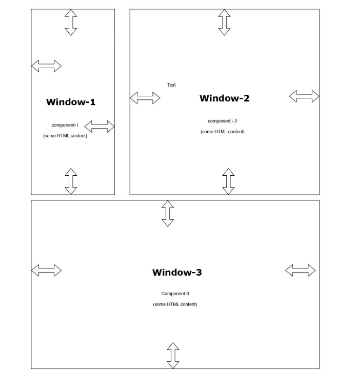

# <a href="https://github.com/prabhatchanchal/DataNeuronTask" style="background-color: #1a73e8; color: white; font-weight: bold; padding: 10px 20px; border-radius: 5px; text-decoration: none;">Task 1</a>

This is the source code of the task: <a href="https://github.com/prabhatchanchal/DataNeuronTask" style="background-color: #1a73e8; color: white; font-weight: bold; padding: 10px 20px; border-radius: 5px; text-decoration: none;">DataNeuronTask</a>

  

  <h1 style="font-size: 2rem; font-weight: bold; margin-bottom: 10px;">About</h1>
  
Hi there! I'm Prabhat, a Full Stack developer with over a 1.8 years of experience. 
  

  

  
In this Task I've impleted the sample interface where there is three boxes.
    Each boxes 4 sides are dragable and it will change the shape of the box. All the shapes are dragable and each will influence other to change the 
    shape and adjust it to fit inside container.

  <h1 style="font-size: 2rem; font-weight: bold; margin-bottom: 10px;">Tech Stack</h1>
  <ul>
    <li>HTML</li>
    <li>CSS</li>
    <li>JavaScript</li>
    <li>JQuery</li>
  </ul>

  <h1>Here is the layout of the project:</h1>
  

    

### Here is the execution of the project:

